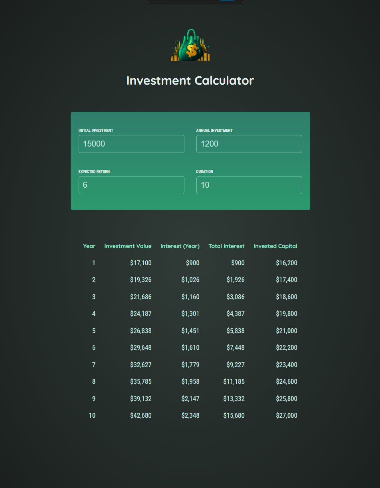

# React Investment Calculator

This is a simple investment calculator built using React. It allows users to input their investment 
details and see how their investments grow over time, focusing on key React concepts like state management, 
props, and dynamic UI updates.
<br><br>


## 🚀 Getting Started

### **Prerequisites**
Make sure you have the following installed before running the project:
- **Node.js** (Download from [nodejs.org](https://nodejs.org/))
- **npm** or **yarn** (Comes with Node.js)
<br>

### **Installation**
1. Clone this repository:
   ```sh
   git clone https://github.com/nathenpriyonggo/react-investment-calculator/
   ```
2. Navigate to the directory
   ```sh
   cd react-investment-calculator
   ```
3. Install dependencies:
   ```sh
   npm install
   ```
4. Start the development server:
   ```sh
   npm run dev
   ```
5. Open ```http://localhost:5173/``` in your browser.
<br>

## 🛠️ Built With
- **React** - A JavaScript library for building user interfaces
- **Vite** - A fast build tool for modern web projects
<br>

## 💹 Features
- **User Input Form** - Allows users to input investment details dynamically.
- **Real-time Calculation** - Updates investment growth projections instantly.
- **Formatted Output** - Displays investment details in a structured table.
- **Responsive Design** - Works seamlessly on different screen sizes.
<br>


## 🖥️ Preview
<p align="center"></p>
<br>

## 📜 License
This project is open-source. Feel free to modify and expand upon it!
<br><br>


---

✨ Happy coding! 🚀
